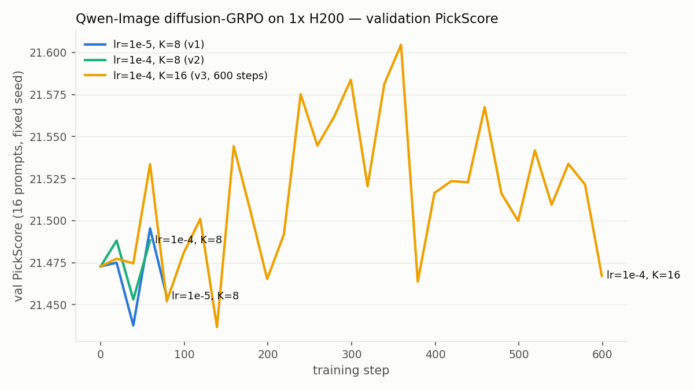
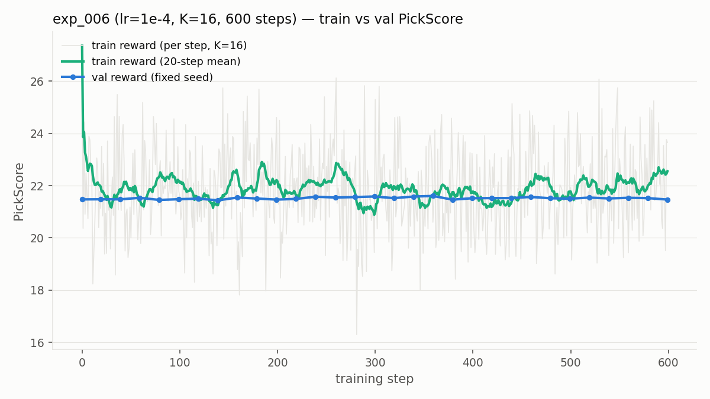

# Qwen-Image diffusion-GRPO 首次真模型训练（1×H200 + PickScore）

**日期**：2026-07-03 ~ 07-05
**分支**：`diffusion/sde-algo`（commit `48296062`）
**硬件**：hyper01，容器 `sglang-diffusion-qwenimage`，8×H200 141GB（实际用 2 张：GPU0 训练、GPU1 reward）
**目标**：在真模型 `Qwen/Qwen-Image`（20B MMDiT）上端到端跑通 diffusion-GRPO LoRA 训练，
用真实偏好 reward（PickScore-v1）与真实 prompt 数据集（pick-a-pic SFW 4000 条）产出首批训练成果。

---

## 一、结论（TL;DR）

1. **端到端全链路首次在真模型上打通并稳定长跑**：20B 加载 → SDE rollout（T=10, true-CFG 4.0, K=16）
   → PickScore GPU 打分 → LOO advantage → micro-batch 梯度累积训练 → 固定 seed 验证 + 图片落盘
   → LoRA checkpoint，600 步无中断，~72 s/步，显存 120/141 GB。
2. **学习信号可见但幅度有限**：val PickScore 从基线 21.47 中段爬至 **21.60（+0.13，step 359）**，
   末段回落至 ~21.52；逐 prompt 4 升 4 降。三组消融（lr 1e-5/1e-4、K 8/16）中仅 lr=1e-4 + K=16
   出现超出噪声（±0.05）的爬升。
3. **主要瓶颈是单卡吞吐下的每步样本量**：每步 16 张图 × 600 步 ≈ 9600 张训练图像，约为
   Flow-GRPO 论文设置（每步数百张、数千步）的 1/20。要拿到论文级提升（+1~2 PickScore），
   下一步应做多卡 DP（8×H200 → 每步 128 张）或等效的更长训练。

## 二、实验矩阵

| exp | lr | K | 每步图像 | 步数 | val 起点 | val 峰值 | val 终点 | 结论 |
|---|---|---|---|---|---|---|---|---|
| exp_004 | 1e-5 | 8 | 8 | 84（停） | 21.473 | 21.495 | 21.455 | 平：lr 太小 |
| exp_005 | 1e-4 | 8 | 8 | 107（停） | 21.473 | 21.488 | 21.488 | 平：样本量不足 |
| exp_006 | 1e-4 | 16 | 16 | **600 完成** | 21.473 | **21.605** | 21.467 | 中段有效爬升后回落 |

完整数值见 `val_reward_curves.tsv` / `train_reward_exp006.tsv` / `experiments.tsv`。




## 三、逐 prompt 前后对比（同 seed 同初始噪声，`per_prompt_delta.tsv`）

| prompt | step 0 | step 600 | Δ |
|---|---|---|---|
| a dragon on top of a mountain | 25.43 | 25.54 | **+0.11** |
| I need an image of sea in red | 22.03 | 22.22 | **+0.19** |
| portrait of a beautiful bird | 21.44 | 21.64 | **+0.20** |
| Beauty woman in a rave | 23.76 | 24.03 | **+0.27** |
| 3d render … goblin knight | 23.06 | 22.88 | -0.18 |
| knight on a horse fighting a dragon … | 20.69 | 20.43 | -0.27 |
| dark magic | 19.98 | 19.20 | -0.78 |
| MG Metro smashing through wall … | 22.63 | 21.72 | -0.92 |

生成图像对比拼图：`val_images_before_after.png`（上排 base、下排 600 步后，含 PickScore 标注）。

## 四、诊断：为什么提升有限

- **信号量**：GRPO 的组内 LOO advantage 在 K=16、B=1（每步 1 个 prompt）下方差仍大；
  train reward 单步波动 ±3（见图 2 灰线）。Flow-GRPO 论文每步 few-hundred 图像。
- **训练量**：9600 张图对 20B 模型的 LoRA（rank 32，仅 attention to_q/k/v/out）是很小的更新预算。
- **无 lr decay**：lr=1e-4 恒定，中段（~360 步）达峰后出现漂移回落，符合无 scheduler 的特征。
- 排除项：micro-batch 累积与 full-batch 已验证逐位等价（tiny 模型 step-0 loss 差 2.4e-6）；
  验证用固定 seed，曲线不受采样噪声影响（同 seed 重复方差 < 0.01）。

## 五、下一步建议（按性价比排序）

1. **多卡 DP**（8×H200 → 每步 128 图，约等于 Flow-GRPO 论文量级）：需要接线 rank/world_size
   ＋数据分片＋梯度 all-reduce，是拿到论文级曲线的最短路径。
2. **lr scheduler**（warmup + cosine decay）＋更长训练（2000 步）。
3. LoRA targets 扩展到 MLP（img_mlp/txt_mlp），rank 64。
4. KL 正则（beta>0，代码已支持 LoRA disable_adapter 参考策略）抑制末段漂移。

## 六、复现

```bash
# 环境（容器 sglang-diffusion-qwenimage，见 session/20260703_115619/）：
# uv sync --locked --group test && uv pip install megatron-core peft "diffusers>=0.38,<0.39"
# torch 必须 cu128：uv pip install --no-config --python .venv --reinstall-package torch \
#   torch==2.11.0+cu128 --index-url https://download.pytorch.org/whl/cu128 \
#   --extra-index-url https://pypi.org/simple --index-strategy unsafe-best-match
# HF 下载需 HF_HUB_DISABLE_XET=1；运行需 UV_NO_SYNC=1

# 数据集
uv run python tools/export_diffusion_prompts.py \
  --dataset CarperAI/pickapic_v1_no_images_training_sfw --split train --column caption \
  --train-size 4000 --val-size 64 --out-dir /data/datasets/qwen_image_grpo

# 训练（exp_006 配置即仓库默认）
UV_NO_SYNC=1 HF_HOME=/data/hf_cache uv run --frozen python examples/run_diffusion_grpo.py \
  --config examples/configs/diffusion_grpo_qwen_image_h200.yaml
```

Checkpoint：`hyper01:/data/workspace/RL/RL/results/diffusion_grpo_qwen_image_h200/step_{50..600}/`
（PEFT LoRA adapter + optimizer.pt）。加载：`QwenImagePipeline.from_pretrained("Qwen/Qwen-Image")`
后 `pipe.transformer = PeftModel.from_pretrained(pipe.transformer, <step_dir>)`。

## 七、文件清单

```
README.md                     本文件
experiments.tsv               实验台账
val_reward_curves.tsv         三实验 val 曲线数据
train_reward_exp006.tsv       exp_006 train reward/loss 逐步数据
per_prompt_delta.tsv          逐 prompt 前后对比
val_reward_compare.png        三实验 val 曲线图
exp006_train_val.png          exp_006 train vs val 图
val_images_before_after.png   8 prompt 前后生成图对比拼图
```
